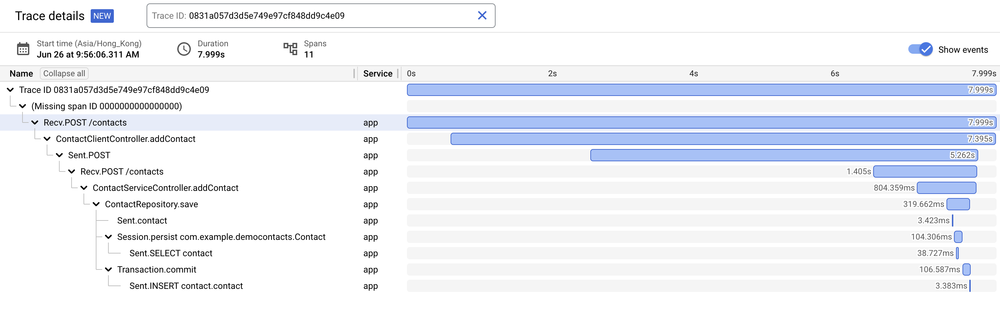

# Demonstrate usage of OpenTelemetry Java Agent with Auto-Configuration for OpenTelemetry in Google Cloud

### Why? 

You may have a legacy Java application but you want to leverage tools like Cloud Trace for better observability, which allows you to see the entire path of a request as it flows through your application, from the frontend to the backend. This helps you identify bottlenecks and errors that may be occurring in different parts of your application.

### What is OpenTelemetry Java Agent? 

Automatic instrumentation with Java uses a Java agent JAR that can be attached to any Java 8+ application. It dynamically injects bytecode to capture telemetry from many popular libraries and frameworks. It can be used to capture telemetry data at the “edges” of an app or service, such as inbound requests, outbound HTTP calls, database calls, and so on. 

### What is Auto-Configuration for OpenTelemetry in Google Cloud?

### How does it look like? 

